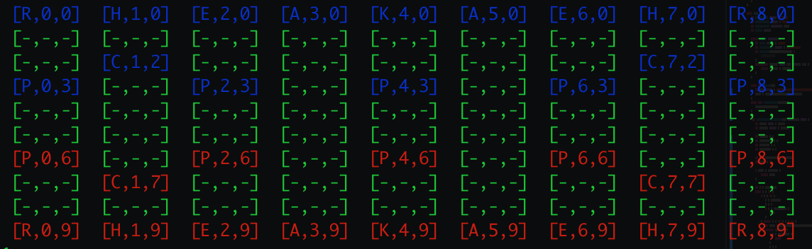

# cotuong-ios
cotuong for iOS

## How to run
1. run: `swift -suppress-warnings xqchess.playground/Contents.swift`
```
1- new game
2- display board
3- quit game
```
2.choose `1- new game` to make a new game

3.choose `2- display board` to display initial game board


## FEN for Xiangqi
refer to : http://wxf.ca/xq/computer/fen.pdf for more detail

notation:
```
K: King
A: Advisor
E: Elephant
R: Rook
C: Cannon
H: Horse
P: PAWN
```